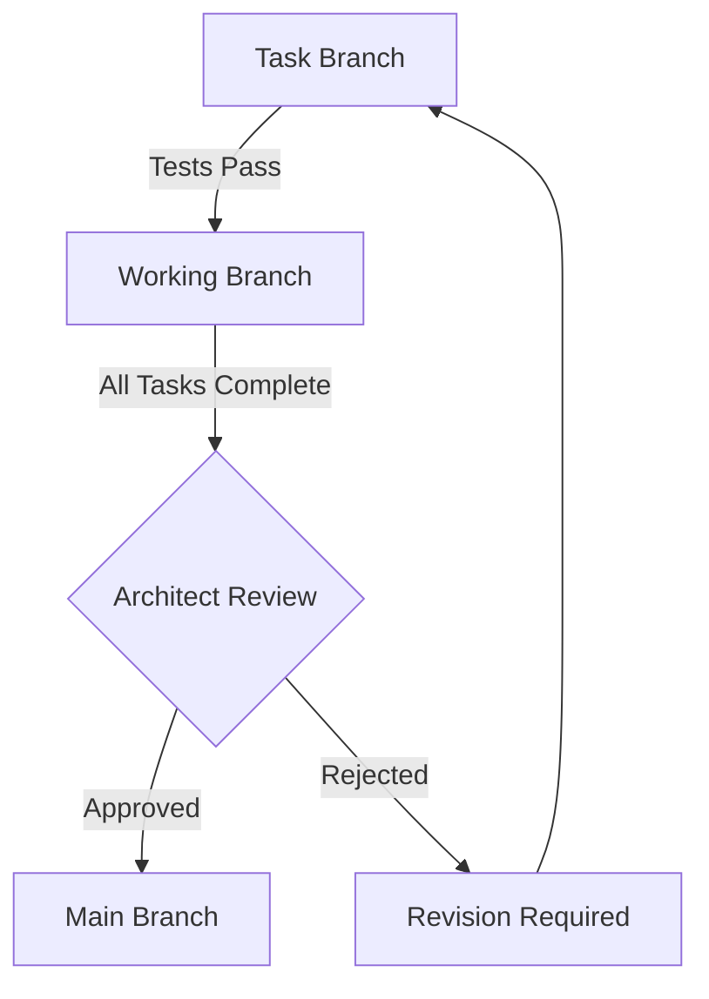
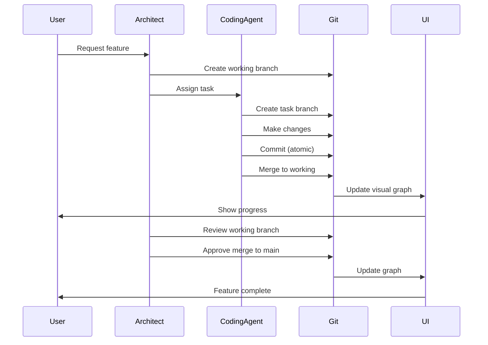

# Comprehensive Git Workflow Design for Multi-Agent Coding System

## Executive Summary

This document outlines a professional Git workflow designed specifically for a multi-agent coding system. The workflow ensures safety, traceability, and reversibility while providing an excellent user experience with visual git history and easy task management.

## 1. Branch Naming Conventions and Hierarchy

### Branch Types and Naming Pattern

```
main                                    # Protected production branch
└── working/[session-id]               # Working branch per session
    ├── task/[task-id]/[description]   # Individual task branches
    ├── fix/[issue-id]/[description]   # Bug fix branches
    └── checkpoint/[timestamp]         # Save point branches
```

### Naming Conventions

- **Working Branch**: `working/session-[timestamp]-[user-id]`
  - Example: `working/session-20250117-143022-user123`
  
- **Task Branches**: `task/[task-id]/[kebab-case-description]`
  - Example: `task/TASK-001/add-user-authentication`
  
- **Fix Branches**: `fix/[issue-id]/[kebab-case-description]`
  - Example: `fix/REG-042/fix-login-validation`
  
- **Checkpoint Branches**: `checkpoint/[timestamp]-[description]`
  - Example: `checkpoint/20250117-150000-before-refactoring`

### Branch Protection Rules

```yaml
branch_protection:
  main:
    - no_direct_commits: true
    - require_architect_approval: true
    - require_passing_tests: true
    - dismiss_stale_reviews: true
    
  working/*:
    - allow_agent_commits: true
    - require_atomic_commits: true
    - auto_delete_after_merge: false
```

## 2. Commit Strategy - Atomic Commits per Task

### Commit Message Format

```
[AGENT-TYPE] Task #[TASK-ID]: [Action] [Description]

- [Detail 1]
- [Detail 2]

Agent: [agent-id]
Parent-Task: [parent-task-id]
Reversible: true
```

### Examples

```
[CODING] Task #TASK-001: Add user authentication module

- Implemented JWT token generation
- Added login/logout endpoints
- Created user session management

Agent: coding-agent-01
Parent-Task: PLAN-42
Reversible: true
```

### Atomic Commit Rules

1. **One Task = One Commit**: Each task produces exactly one commit
2. **Self-Contained Changes**: Each commit must be independently reversible
3. **Passing Tests**: Commit only after tests pass
4. **Documented Changes**: Include file changes summary in commit body

## 3. Merge Strategy and Conflict Resolution

### Merge Flow



### Merge Strategies by Branch Type

```python
merge_strategies = {
    "task_to_working": {
        "strategy": "squash",
        "conditions": ["tests_pass", "no_conflicts"],
        "auto_merge": True
    },
    "working_to_main": {
        "strategy": "merge --no-ff",
        "conditions": ["architect_approval", "all_tests_pass"],
        "auto_merge": False
    },
    "hotfix_to_main": {
        "strategy": "merge --no-ff",
        "conditions": ["critical_fix", "emergency_approval"],
        "auto_merge": False
    }
}
```

### Conflict Resolution Protocol

1. **Automatic Resolution** (for simple conflicts):
   ```python
   conflict_resolution_rules = {
       "formatting": "use_prettier",
       "imports": "merge_both_keep_sorted",
       "version_numbers": "use_higher",
       "generated_files": "regenerate"
   }
   ```

2. **Agent-Assisted Resolution**:
   - Coding agent analyzes conflict
   - Generates resolution options
   - Architect agent reviews and approves

3. **Escalation Path**:
   - Simple conflicts → Coding Agent
   - Complex conflicts → Architect Agent
   - Critical conflicts → User intervention

## 4. Reversion Mechanism

### Task-Level Reversion

```python
class TaskReversion:
    def revert_task(self, task_id: str) -> RevertResult:
        """
        Revert a specific task without affecting other changes.
        """
        # Find task commit
        commit = self.find_task_commit(task_id)
        
        # Create reversion branch
        revert_branch = f"revert/task-{task_id}-{timestamp()}"
        
        # Apply revert
        if commit.is_atomic:
            return self.simple_revert(commit)
        else:
            return self.complex_revert(commit, task_id)
```

### Reversion Strategies

1. **Simple Revert**: For atomic commits
   ```bash
   git revert --no-edit [commit-sha]
   ```

2. **Selective Revert**: For specific files within a commit
   ```python
   def selective_revert(commit_sha: str, files: List[str]):
       # Checkout specific files from parent commit
       for file in files:
           git.checkout(f"{commit_sha}^", file)
       # Create new commit
       git.commit("Revert specific changes")
   ```

3. **Cascade Revert**: For dependent tasks
   ```python
   def cascade_revert(task_id: str):
       # Find all dependent tasks
       dependents = graph.get_dependents(task_id)
       # Revert in reverse topological order
       for task in reversed(topological_sort(dependents)):
           revert_task(task)
   ```

## 5. Save Points/Checkpoints System

### Checkpoint Creation

```python
class CheckpointManager:
    def create_checkpoint(self, description: str, auto: bool = False):
        """Create a save point for the current state."""
        checkpoint = {
            "id": generate_checkpoint_id(),
            "branch": f"checkpoint/{timestamp()}-{slugify(description)}",
            "parent_branch": self.current_branch,
            "commit_sha": self.current_commit,
            "metadata": {
                "description": description,
                "auto_created": auto,
                "tasks_completed": self.get_completed_tasks(),
                "tests_status": self.get_test_status(),
                "timestamp": datetime.now()
            }
        }
        
        # Create checkpoint branch
        self.git.create_branch(checkpoint["branch"])
        
        # Store checkpoint metadata
        self.store_checkpoint(checkpoint)
        
        return checkpoint
```

### Automatic Checkpoints

```python
checkpoint_triggers = {
    "before_major_refactoring": {
        "condition": lambda: self.detect_major_changes(),
        "description": "Auto-checkpoint before major refactoring"
    },
    "after_milestone": {
        "condition": lambda: self.is_milestone_complete(),
        "description": "Milestone completed"
    },
    "before_risky_operation": {
        "condition": lambda: self.detect_risky_operation(),
        "description": "Before risky operation"
    },
    "scheduled": {
        "condition": lambda: self.hours_since_last_checkpoint() > 4,
        "description": "Scheduled checkpoint"
    }
}
```

### Checkpoint Restoration

```python
def restore_checkpoint(checkpoint_id: str, strategy: str = "branch"):
    """Restore to a previous checkpoint."""
    checkpoint = self.get_checkpoint(checkpoint_id)
    
    if strategy == "branch":
        # Create new branch from checkpoint
        new_branch = f"restore/{checkpoint_id}-{timestamp()}"
        git.checkout("-b", new_branch, checkpoint["commit_sha"])
    
    elif strategy == "reset":
        # Hard reset current branch (with confirmation)
        if self.confirm_reset():
            git.reset("--hard", checkpoint["commit_sha"])
    
    elif strategy == "cherry_pick":
        # Selectively apply changes since checkpoint
        commits = self.get_commits_since(checkpoint["commit_sha"])
        selected = self.user_select_commits(commits)
        for commit in selected:
            git.cherry_pick(commit)
```

## 6. Visual Representation of Git History

### Git Graph Visualization

```python
class GitVisualizer:
    def generate_graph(self, branch: str = None):
        """Generate visual representation of git history."""
        
        # ASCII representation for CLI
        ascii_graph = """
        * main
        |\  
        | * working/session-20250117 (HEAD)
        | |\  
        | | * task/TASK-003/add-tests
        | | * task/TASK-002/implement-feature
        | |/  
        | * checkpoint/20250117-140000
        | * task/TASK-001/initial-setup
        |/  
        * Initial commit
        """
        
        # Interactive web representation
        web_graph = {
            "nodes": [
                {
                    "id": "commit-1",
                    "type": "task",
                    "task_id": "TASK-001",
                    "agent": "coding-agent",
                    "status": "completed",
                    "reversible": True
                }
            ],
            "edges": [
                {"from": "commit-1", "to": "commit-2"}
            ]
        }
        
        return ascii_graph, web_graph
```

### Terminal UI Component

```python
class GitGraphUI:
    def render(self):
        """Render git graph in terminal with rich formatting."""
        return f"""
╔══════════════════════════════════════════════════════════════╗
║                    Git History Visualization                  ║
╠══════════════════════════════════════════════════════════════╣
║  ● {Color.GREEN}main{Color.END} (protected)                                       ║
║  │                                                           ║
║  ├─● {Color.BLUE}working/session-20250117{Color.END} (current)                    ║
║  │ │                                                         ║
║  │ ├─● {Color.YELLOW}task/TASK-003{Color.END} ✓ Tests added                        ║
║  │ ├─● {Color.YELLOW}task/TASK-002{Color.END} ✓ Feature implemented                 ║
║  │ │                                                         ║
║  │ ├─◆ {Color.CYAN}checkpoint/before-refactor{Color.END} (save point)            ║
║  │ │                                                         ║
║  │ └─● {Color.YELLOW}task/TASK-001{Color.END} ✓ Initial setup                       ║
║  │                                                           ║
║  └─● Previous session merged                                 ║
╚══════════════════════════════════════════════════════════════╝
        
Legend: ● Commit  ◆ Checkpoint  ✓ Completed  ⚠ Failed
        """
```

## 7. Safety Checks and Guards

### Pre-Commit Guards

```python
class GitSafetyGuard:
    def __init__(self):
        self.checks = [
            self.check_no_secrets,
            self.check_no_large_files,
            self.check_no_merge_conflicts,
            self.check_tests_pass,
            self.check_code_quality,
            self.check_branch_protection
        ]
    
    def check_no_secrets(self) -> CheckResult:
        """Scan for API keys, passwords, etc."""
        patterns = [
            r'api[_-]?key\s*=\s*["\'][\w\-]+["\']',
            r'password\s*=\s*["\'][^"\']+["\']',
            r'BEGIN\s+(?:RSA|DSA|EC|OPENSSH)\s+PRIVATE\s+KEY'
        ]
        # Scan staged files
        return self.scan_files(patterns)
    
    def check_branch_protection(self) -> CheckResult:
        """Ensure branch protection rules are followed."""
        current_branch = self.git.current_branch()
        
        if current_branch == "main":
            return CheckResult(
                passed=False,
                message="Direct commits to main branch not allowed"
            )
        
        if current_branch.startswith("working/"):
            # Check if agent has permission
            if not self.agent_has_permission(self.current_agent):
                return CheckResult(
                    passed=False,
                    message="Agent lacks permission for working branch"
                )
        
        return CheckResult(passed=True)
```

### Post-Merge Validation

```python
class PostMergeValidator:
    async def validate_merge(self, merge_commit: str):
        """Validate merge didn't break anything."""
        validations = {
            "tests_still_pass": self.run_test_suite(),
            "no_regression": self.check_performance_metrics(),
            "dependencies_intact": self.verify_dependencies(),
            "build_succeeds": self.run_build()
        }
        
        for check, result in validations.items():
            if not result.passed:
                # Automatic rollback
                await self.rollback_merge(merge_commit, reason=check)
                raise MergeValidationError(f"Failed {check}: {result.message}")
```

## 8. Integration with Existing Agent Workflow

### Agent Git Operations Interface

```python
class AgentGitInterface:
    """Standardized git operations for all agents."""
    
    def __init__(self, agent_id: str, git_ops: GitOperations):
        self.agent_id = agent_id
        self.git_ops = git_ops
        self.branch_manager = BranchManager()
    
    async def start_task(self, task_id: str, description: str):
        """Start working on a new task."""
        # Create task branch
        branch_name = f"task/{task_id}/{slugify(description)}"
        self.git_ops.create_branch(branch_name)
        
        # Emit event
        await self.event_bridge.emit({
            "type": "git.branch.created",
            "agent_id": self.agent_id,
            "task_id": task_id,
            "branch": branch_name
        })
    
    async def commit_task(self, task_id: str, changes: Dict[str, Any]):
        """Commit changes for a task."""
        # Stage changes
        self.git_ops.stage_changes()
        
        # Generate commit message
        message = self.generate_commit_message(task_id, changes)
        
        # Create atomic commit
        commit_sha = self.git_ops.commit(
            message=message,
            author=f"{self.agent_id} <{self.agent_id}@agent.system>"
        )
        
        # Record for reversion
        await self.record_reversible_commit(task_id, commit_sha)
        
        return commit_sha
```

### Integration Points

1. **Request Planner**:
   - Creates working branch for session
   - Sets up initial repository state

2. **Coding Agent**:
   - Creates task branches
   - Makes atomic commits
   - Handles merge to working branch

3. **Test Agent**:
   - Creates test branches
   - Validates changes don't break tests
   - Marks commits as test-verified

4. **Architect Agent**:
   - Reviews working branch changes
   - Approves merge to main
   - Manages checkpoint strategy

### Event Flow



## Implementation Recommendations

### Phase 1: Core Git Workflow (Week 1-2)
1. Implement enhanced `GitOperations` class with new methods
2. Create `BranchManager` with naming conventions
3. Add atomic commit functionality
4. Basic reversion mechanism

### Phase 2: Safety and Validation (Week 3)
1. Implement pre-commit guards
2. Add post-merge validation
3. Create conflict resolution system
4. Add safety checks

### Phase 3: Checkpoints and UI (Week 4)
1. Implement checkpoint system
2. Create visual git graph
3. Add terminal UI components
4. Integration with existing UI

### Phase 4: Advanced Features (Week 5-6)
1. Cascade reversion
2. Intelligent conflict resolution
3. Performance optimization
4. Comprehensive testing

## Conclusion

This Git workflow provides a robust, safe, and user-friendly system for managing code changes in a multi-agent environment. The combination of atomic commits, branch protection, checkpoints, and visual feedback ensures both safety and usability while maintaining the flexibility needed for AI-driven development.