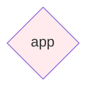

# Architecture Analysis

Generated: 2025-06-14T21:25:25.791270

## Summary

Architecture analysis of test_project:
- 1 components discovered
- 0 dependencies mapped
- Technologies: Flask
- Patterns: 

## Recommendations

- 💡 Consider adopting a clear architectural pattern

## Architecture Diagram

## Metrics

- **Total Lines**: 11
- **Avg Component Size**: 11.0
- **Coupling Score**: 0.0
